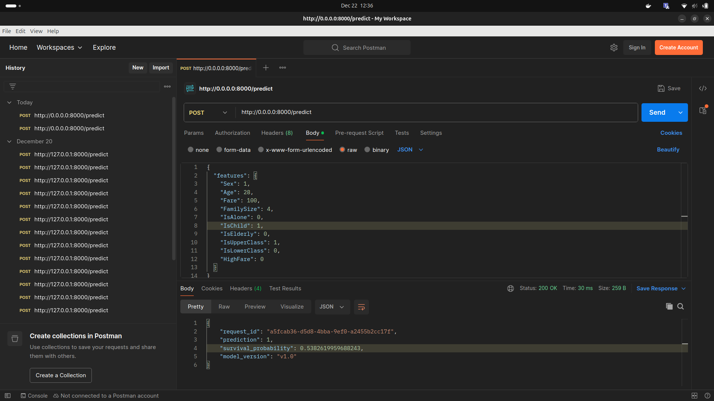
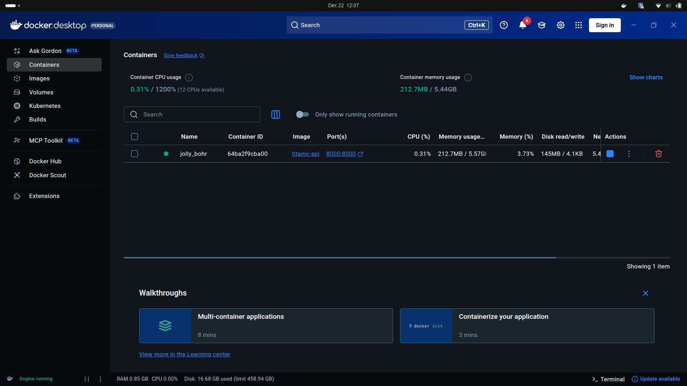
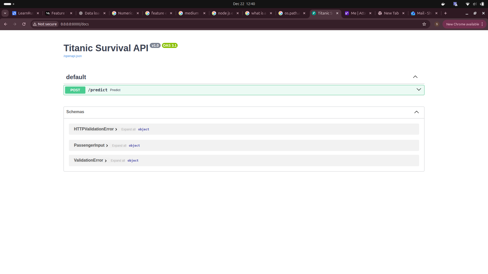

# Deployment Notes

This document describes how to run, test, and monitor the Titanic Survival Prediction service (FastAPI + Docker) and the basic drift monitoring setup.

## Project Structure

```
src/
├── deployment/
│   └── api.py                # FastAPI inference service
├── monitoring/
│   └── drift_checker.py      # Data drift detection (PSI)
├── models/
│   └── best_model.pkl
├── features/
│   ├── X_train.csv
│   └── feature_list.json
prediction_logs.csv
Dockerfile
requirements.txt
```

## Model overview
- Problem: Binary classification (Titanic survival)  
- Model: Tree-based classifier (RandomForest / XGBoost-style)  
- Target: `1 → Survived`, `0 → Did not survive`  
- Inference output: prediction, survival probability, unique request ID

## Run API locally (no Docker)
1. Activate virtual environment:
    ```bash
    source venv/bin/activate
    ```
2. Install dependencies:
    ```bash
    pip install -r requirements.txt
    ```
3. Start FastAPI:
    ```bash
    uvicorn src.deployment.api:app --reload
    ```
4. Open Swagger UI: `http://127.0.0.1:8000/docs`

## Run with Docker
1. Build the image:
    ```bash
    docker build -t titanic-api .
    ```
2. Run the container:
    ```bash
    docker run -p 8000:8000 titanic-api
    ```
3. Access API and test in postman: http://0.0.0.0:8000/predict

## API usage
- Endpoint: `POST /predict`

Sample request (JSON):
```json
{
  "features": {
    "Sex": 1,
    "Age": 28,
    "Fare": 100,
    "FamilySize": 4,
    "IsAlone": 0,
    "IsChild": 1,
    "IsElderly": 0,
    "IsUpperClass": 1,
    "IsLowerClass": 0,
    "HighFare": 0
  }
}

```

Sample response:
```json
{
    "request_id": "a5fcab36-d5d8-4bba-9ef0-a2455b2cc17f",
    "prediction": 1,
    "survival_probability": 0.5382619959688243,
    "model_version": "v1.0"
}
```

## Prediction logging
Each request is appended to `prediction_logs.csv` with:
- Timestamp
- Request ID
- Input features
- Prediction
- Probability

Purpose: auditing, debugging, drift detection, and monitoring.

## Data drift monitoring
- Method: Population Stability Index (PSI)  
- Reference data: `src/features/X_train.csv`  
- Production data: `prediction_logs.csv` (logged inputs)

Run drift check:
```bash
python src/monitoring/drift_checker.py
```
Output: `drift_report.csv`

## Why input logging is required
Drift detection compares training and production feature distributions; without logged inputs, monitoring is not possible.


## Screenshots



